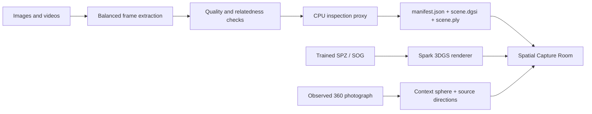

# Dynamic Gaussian Scene Intelligence

**A local-first spatial capture room for photographic 360° context, image/video ingestion, and trained 3D Gaussian scenes.**

[](https://marinjursic.github.io/dynamic-gaussian-scene-intelligence/)
[](https://github.com/MarinJursic/dynamic-gaussian-scene-intelligence/actions/workflows/pages.yml)

DGSI joins a TypeScript/Three.js review room with a Python capture pipeline. The browser opens a fully surrounding, real photographic room immediately; it can also inspect the deterministic CPU proxy produced by the reference pipeline or open trained `.spz` and `.sog` scenes with anisotropic Gaussian scales, rotations, opacity, and spherical harmonics through [Spark](https://github.com/sparkjsdev/spark).

## Continuous application walkthrough

[](docs/walkthrough/app-walkthrough.mp4)

[Open the full-resolution MP4](docs/walkthrough/app-walkthrough.mp4) · [Open the poster frame](docs/walkthrough/app-walkthrough-poster.jpg)

The walkthrough is a single continuous interaction with the running application: real-photo source review, smooth room rotation, the bundled trained kitchen Gaussian, camera movement, light theme, and scene details. It is recorded from the app rather than assembled from concept images.

## What opens by default

The included example is the **ESO Guesthouse living room in Vitacura, Chile**, photographed by the European Southern Observatory and published under [CC BY 4.0](https://creativecommons.org/licenses/by/4.0/).

- The archived 6144×3072 equirectangular derivative supplies real, fully surrounding photographic context; the viewer uses a 4096×2048 WebGL-safe derivative to avoid device texture-limit failures.
- Twelve 1280×820 rectilinear source directions drive the filmstrip and source-match view.
- The environment sphere remains present outside Inspect mode, so rotating or walking never reveals a black void.
- Movement is limited to a declared safe hull because a single-center panorama does not recover metric translation or parallax.
- Inspect mode exposes a deterministic CPU point proxy generated from those same real source views.

[Capture context](public/captures/eso-guesthouse/context.jpg) · [WebGL viewer derivative](public/captures/eso-guesthouse/context-webgl.jpg) · [Scene manifest](public/room-demo/manifest.json) · [CPU proxy PLY](public/room-demo/scene.ply) · [Attribution and transformations](THIRD_PARTY_NOTICES.md)

The interface always states which representation is active:

| Label in the app | What it means |
|---|---|
| **360° photographic capture** | An observed equirectangular photograph projected around the viewer; not trained 3DGS |
| **CPU preview proxy** | Portable isotropic RGB points generated by the reference Python pipeline; not optimized 3DGS |
| **Imported anisotropic Gaussian** | A trained `.spz` loaded locally and rendered by Spark |

This distinction is deliberate. The repository does not present a panorama or point cloud as photorealistic novel-view synthesis.

## Included spatial examples

The example selector provides three materially different, locally bundled records:

| Example | Representation | Purpose |
|---|---|---|
| **ESO photo room** | 4096×2048 observed 360° context + CPU proxy | Full-surround room review with no uncovered black viewport |
| **AWS kitchen SOG** | Trained anisotropic Gaussian interior | High-fidelity, movable 3DGS/SOG renderer proof |
| **AWS Venetian Hall SOG** | Trained panorama-derived Gaussian hall | A second real architectural capture with different geometry and lighting |

The trained samples come from AWS’s MIT-0 [Open Source 3D Reconstruction Toolbox for Gaussian Splats](https://github.com/aws-solutions-library-samples/guidance-for-open-source-3d-reconstruction-toolbox-for-gaussian-splats-on-aws), where they are published as representative outputs of the full media → SfM → Gaussian-training pipeline. [Attribution and local asset details](THIRD_PARTY_NOTICES.md).

## Interaction model

- Drag to look in every direction; the wheel advances or retreats inside the safe hull.
- Enable **Walk** and use WASD or the arrow keys. Shift increases movement speed.
- **Tour** follows a centripetal path using arc-length sampling and quaternion-smoothed orientation.
- **360°** performs one continuous revolution rather than cutting between viewpoints.
- **Source match** compares any of the twelve real source directions with the active view.
- **Coverage** shows registered source directions and the navigation boundary.
- **Inspect** reveals the CPU point proxy or the currently imported Gaussian scene.
- **Scene details** controls context visibility, rendering budget, exposure, and exposure presets.
- **Add capture / splat** accepts trained `.spz` or `.sog` files locally; image and video batches are forwarded to the configured Python worker and the returned scene is loaded into the viewer.
- Light and dark themes persist across sessions and preserve full control contrast.

All mode buttons, camera controls, exposure presets, source thumbnails, inspector controls, drag-and-drop handling, and theme switching are functional.

## Architecture



| Surface | Implementation | Responsibility |
|---|---|---|
| Spatial viewer | Next.js, React, TypeScript, Three.js | Camera, source matching, coverage, safe movement, themes |
| Gaussian renderer | `@sparkjsdev/spark` | Native `.spz` / `.sog` decoding and anisotropic 3DGS rendering |
| Reference pipeline | Python, NumPy, Pillow, FFmpeg | Balanced media extraction, quality checks, deterministic proxy packaging |
| Local API | FastAPI | Mixed image/video upload and generated scene delivery |
| Scene contract | JSON, packed binary, PLY | Bounds, camera pose, capture evidence, quality, and provenance |

## Quick start

Prerequisites: Node.js 22.13+, Python 3.11+, and a WebGL2-capable browser.

```bash
npm install
python3 -m venv .venv
.venv/bin/python -m pip install -e '.[test]'

# Terminal 1 — browser viewer
npm run dev

# Terminal 2 — optional image/video reconstruction worker
DGSI_SCENE_ROOT="$PWD/runtime-scenes" \
  .venv/bin/uvicorn dgsi.api:app --host 127.0.0.1 --port 8016
```

The hosted ESO room, two trained AWS examples, and local `.spz` / `.sog` import work without the Python process. Image/video upload requires the worker on port `8016`; set `NEXT_PUBLIC_DGSI_API_URL` to use another endpoint and configure `DGSI_ALLOWED_ORIGINS` when serving it cross-origin.

## Capture and import paths

### Open a trained Gaussian scene

Choose **Add capture / splat**, select a `.spz` or `.sog`, or drop it directly onto the room. The file is decoded in the browser and is not uploaded. Spark reads the trained representation, derives a camera fit from its bounds, and switches the classification to **Imported anisotropic Gaussian** without retaining unrelated ESO attribution or imagery.

SPZ is the recommended browser format because it preserves Gaussian position, anisotropic scale, rotation, opacity, color, and spherical-harmonic data in a compact package. See the [SPZ reference implementation](https://github.com/nianticlabs/spz).

### Process multiple images or videos

The picker and drop surface accept several images, several videos, or a mixed batch. The Python worker:

1. extracts a balanced frame allocation across all sources;
2. measures resolution, sharpness, exposure, duplication, and relatedness;
3. uses the coherent-capture path or an explicit gallery fallback for unrelated inputs;
4. emits `manifest.json`, `scene.dgsi`, and `scene.ply`;
5. reports that result as a CPU preview proxy, not trained 3DGS.

```bash
curl -X POST http://127.0.0.1:8016/api/ingest \
  -F 'files=@capture/room-01.jpg' \
  -F 'files=@capture/room-02.jpg' \
  -F 'files=@capture/walkthrough.mp4'
```

The production boundary is intentionally open: replace the CPU projection stage with COLMAP camera recovery plus nerfstudio Splatfacto, gsplat, or another evaluated Gaussian optimizer, export SPZ/SOG, and load that result in the same browser.

## Rebuild the real room example

The source views and CPU proxy can be reproduced from the checked-in licensed context derivative:

```bash
./scripts/make-room-capture.sh
./scripts/build-room-demo.sh
```

`make-room-capture.sh` derives twelve perspective directions with FFmpeg’s `v360` filter. `build-room-demo.sh` packages those views, attaches the real source-grounded environment, constrains the safe hull, and writes the source/license metadata into the manifest.

## Scene package

`scene.dgsi` is a small deterministic reference contract:

```text
bytes 0..3    "DGSI"
uint32        version
uint32        point_count
uint32        stride_floats
repeated f32  x y z | r g b | scale | semantic | motion_phase | change | opacity
```

The browser validates the manifest and binary before allocating geometry. It rejects truncated buffers, non-finite values, semantic IDs outside the contract, invalid navigation bounds, malformed camera paths, and manifest/header disagreement.

This packed reference is intentionally simpler than trained 3DGS. True anisotropic Gaussian data enters through SPZ/SOG and Spark rather than being relabeled into the CPU format.

## Verification

```bash
npm run verify
npm audit
```

The verification pipeline builds the production bundle, type-checks TypeScript, lints the application, exercises the rendered application shell and camera mathematics, verifies the real-photo resolution and attribution contract, validates Spark integration and the bundled trained assets, and runs the Python pipeline and API tests.

The browser-side contracts specifically check:

- continuous, clamped tour progress and one-revolution 360° motion;
- safe-hull translation limits;
- real archived 6144×3072 context, WebGL-safe 4096×2048 viewer derivative, and twelve-source manifest;
- separate photographic, CPU-proxy, and trained-Gaussian classifications;
- Spark initialization, native `.spz` / `.sog` loading, and bound-derived camera fit;
- arc-length path sampling and quaternion interpolation;
- persistent light-theme support and accessible controls.

## Accuracy and failure modes

- A single 360° photograph provides complete rotational context, but it does not recover parallax, occluded geometry, collision meshes, or metric translation.
- The CPU output is useful for ingestion, packaging, and inspection tests; it does not optimize anisotropic covariance or appearance.
- A trained SPZ/SOG can provide high-fidelity novel views only within the capture’s trained region. The app does not place unrelated ESO imagery behind imported scenes; uncovered areas use a neutral renderer background and remain visibly outside the trained evidence.
- Unrelated images are kept as an explicit gallery fallback instead of being silently fused.
- Uploads return actionable 4xx responses for unsupported, empty, corrupt, oversized, or over-count batches.
- Web quality still depends on capture overlap, focus, exposure consistency, viewpoint translation, and the optimizer used to create the Gaussian scene.

## Primary references

- Kerbl et al., [3D Gaussian Splatting for Real-Time Radiance Field Rendering](https://repo-sam.inria.fr/fungraph/3d-gaussian-splatting/) (SIGGRAPH 2023)
- Spark, [Three.js 3D Gaussian Splatting renderer](https://github.com/sparkjsdev/spark)
- Niantic Spatial, [SPZ compressed Gaussian format](https://github.com/nianticlabs/spz)
- COLMAP, [Structure-from-Motion tutorial](https://colmap.github.io/tutorial)
- nerfstudio, [Splatfacto documentation](https://docs.nerf.studio/nerfology/methods/splat.html)
- gsplat, [official documentation](https://docs.gsplat.studio/main/)
- ESO, [Guesthouse living room panorama](https://www.eso.org/public/images/gh-livingroom-pan/)

## Repository map

```text
app/                         Spatial Capture Room and camera runtime
python/dgsi/                 Ingestion library, CLI, and API
python/tests/                Deterministic pipeline and API tests
public/captures/             Licensed real-photo capture derivatives
public/room-inputs/          Twelve real rectilinear source directions
public/room-demo/            Context, CPU proxy, manifest, and PLY
scripts/                     Reproducible room derivation and packaging
docs/walkthrough/            Continuous MP4, GIF preview, and poster
THIRD_PARTY_NOTICES.md       Media attribution and transformation record
```

The code is released under the repository license. Third-party capture media remains under the license recorded in [THIRD_PARTY_NOTICES.md](THIRD_PARTY_NOTICES.md).
