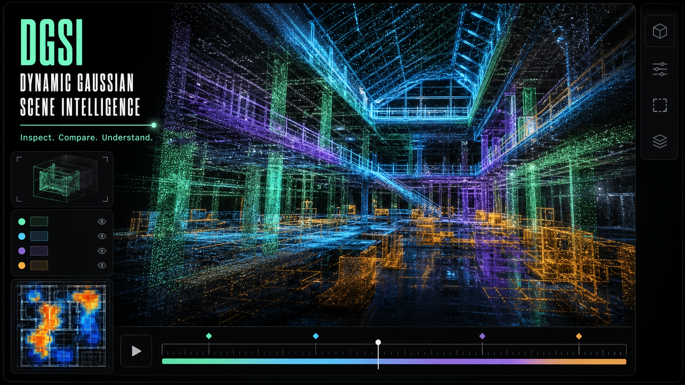
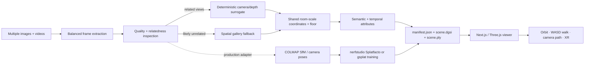

# Dynamic Gaussian Scene Intelligence

**A browser workbench for reconstructing, streaming, comparing, and inspecting spatial captures.**



DGSI is a portfolio-grade, local-first MVP spanning a TypeScript/Three.js viewer and a real Python ingestion service. It accepts **multiple images, multiple videos, or both in one batch**; extracts and balances frames across every source; inspects capture quality; creates a deterministic room-scale CPU reconstruction surrogate; and packages the result as a compact browser scene plus PLY.

> **Accuracy contract:** the included CPU path is an inspectable point/gaussian *surrogate*, not trained 3D Gaussian Splatting. It exists so every clone can run the full input → package → browser loop without CUDA, credentials, models, or downloads. The production path is documented separately and should use recovered camera poses plus Gaussian optimization with COLMAP and nerfstudio/gsplat.

## Room capture → completed navigable space

The bundled demo starts with twelve overlapping perspective views derived from one
coherent, photorealistic living-room panorama. Those views are packaged into a
108.7k-point, inside-facing room shell plus a source-grounded equirectangular
completion layer.

[Room manifest](public/room-demo/manifest.json) · [Room PLY](public/room-demo/scene.ply) · [Source panorama](examples/room-panorama/living-room-panorama.png)

The old contact sheet, image-cut walkthrough, raw-splat screenshot, and legacy demo
GIF are intentionally no longer embedded. Below the lead image, this README now
accepts only a literal, continuous capture of the running application.

The viewer opens in **Rendered room** mode. The source-grounded 360° layer fills the
entire field of view, so camera motion never exposes a black void. Raw reconstruction
points are hidden by default and remain available through **Splat inspection** for
engineering analysis. The automated walkthrough uses a centripetal Catmull–Rom
camera path with eased FOV interpolation instead of cuts between still frames.

Click **⌖** to enter Explore space. WASD or the arrow keys move through the bounded
volume, Q/E changes height, dragging looks around, the wheel moves forward/back, and
Shift boosts movement. The theme button switches the entire workbench between
persistent light and dark themes.

> **Example provenance:** the bundled panorama is an original demonstration asset,
> not a scan of a private residence. Production deployments should use an attributed
> real capture; the documented reference is Waldyrious’s directly photographed
> 5760×2880 GoPro MAX panorama of the Biblioteca Pública de Évora entrance hall,
> published under CC BY-SA 4.0:
> [source and license](https://commons.wikimedia.org/wiki/File:Biblioteca_P%C3%BAblica_de_%C3%89vora_-_Hall_de_entrada_(360_panorama).jpg).

1. A packed scene progressively resolves in the browser.
2. Dynamic semantic points move while the timeline scrubs through 12 seconds.
3. Selecting a semantic class isolates structure, glazing, people, vegetation, or installed work.
4. Date comparison activates a per-splat change heatmap.
5. Measurement, camera-path, relighting, visibility, and compression controls update the live render.
6. Walk mode lets the viewer move through the generated space with WASD/arrows, Q/E height controls, mouse look, wheel movement, and Shift boost.
7. The spatial-view action checks WebXR capability and enters an immersive session when supported.
8. Rendered-room mode shows the completed source context; splat-inspection mode
   exposes the point representation without conflating it with the final view.

## What is implemented

- Custom WebGL gaussian-style point shader with soft Gaussian falloff, opacity, view-depth scaling, cinematic haze, semantic attributes, and time-dependent motion.
- Manifest-driven progressive staged reveal of the packed scene and a render-budget control that changes the actual GPU draw range.
- 4D timeline playback, animated people, pause/scrub that directly drives shader motion, and an automated camera path.
- Semantic selection, per-class visibility, click picking, highlighting, and an inspector.
- A/B temporal-proxy heatmap with change counts and deterministic per-splat confidence derived from the packed attributes.
- Two-point measurement in declared scene units, exposure relighting presets, camera reset, orbit, dolly, class-level non-destructive removal, and responsive mobile layout.
- A real navigable-space mode with manifest-defined bounds and entry pose: WASD/arrows move, Q/E changes height, Shift boosts, drag changes view direction, and wheel motion advances or retreats.
- A persistent, OS-aware light/dark theme with an accessible theme control and light-mode panel contrast.
- An in-view source-filmstrip comparison for the bundled room, linking twelve input views to the live spatial output.
- Multiple-file picker and drag-and-drop importing for mixed image/video batches; every capture group receives a balanced share of the frame budget.
- WebXR capability detection and real `immersive-vr` session request through Three.js.
- CLI and FastAPI ingestion for one or many images, image directories, videos, or mixed batches.
- Quality checks and actionable warnings for resolution, sharpness, exposure, duplicate views, and histogram relatedness.
- Explicit fallback for likely unrelated inputs: preserve them as a circular walkable gallery rather than pretending they form one coherent reconstruction.
- Reproducible sample capture generator, DGSI packed binary, ASCII PLY, JSON manifest, tests, and a ready-to-view bundled scene.

## Architecture



| Layer | Implementation | Responsibility |
|---|---|---|
| Viewer | Next.js, React, TypeScript, Three.js, GLSL | Decode, render, animate, inspect, compare |
| Package | `manifest.json`, `scene.dgsi`, `scene.ply` | Validated portable scene contract, coordinate units, and provenance |
| Ingestion | Python, NumPy, Pillow, packaged FFmpeg | Inspect frames, extract video, reconstruct/package |
| API | FastAPI, multipart uploads, static scene mount | Upload-to-view workflow |
| Production adapter boundary | COLMAP, nerfstudio, gsplat | Real pose recovery and differentiable Gaussian optimization |

## Quick start

Prerequisites: Node.js 22.13+, Python 3.11+, and a WebGL2-capable browser.

```bash
npm install
python3 -m venv .venv
.venv/bin/python -m pip install -e '.[test]'

# Terminal 1 — viewer
npm run dev

# Terminal 2 — local ingestion service
DGSI_SCENE_ROOT="$PWD/runtime-scenes" \
  .venv/bin/uvicorn dgsi.api:app --host 127.0.0.1 --port 8016
```

Open the local URL printed by the viewer. The bundled scene works even when the Python API is not running. `Import images + videos` requires the API on port 8016; override it at build time with `NEXT_PUBLIC_DGSI_API_URL`.

In the viewer:

- Drop multiple images and videos anywhere on the scene, or use **Import images + videos**.
- Click **⌖** to enter walk mode.
- Use **WASD** or arrow keys to move, **Q/E** to change height, **Shift** to move faster, drag to look around, and the wheel to move forward/back.
- Click **⌖** again for orbit inspection, or **◉** to replay the reconstructed camera path.

## Reproduce the entire pipeline

The checked-in sample images were created by the generator—no network or private data is involved.

```bash
# Regenerate the legacy synthetic capture
.venv/bin/dgsi sample --output examples/sample-capture --frames 12

# Images → browser package
.venv/bin/dgsi ingest examples/sample-capture \
  --output public/demo \
  --points-per-frame 1800

# Video → browser package (frame extraction is real)
.venv/bin/dgsi ingest examples/sample-capture.mp4 \
  --output runtime-scenes/video-demo \
  --video-fps 2 \
  --max-frames 12

# Mixed batch → one navigable space
.venv/bin/dgsi ingest \
  examples/sample-capture/atrium-000.png \
  examples/sample-capture/atrium-006.png \
  examples/sample-capture.mp4 \
  --output runtime-scenes/mixed-space \
  --video-fps 2 \
  --max-frames 16

# Recreate the photorealistic room views from the checked-in panorama
./scripts/make-room-capture.sh

# Room views → the bundled default scene
.venv/bin/dgsi ingest examples/room-capture \
  --output public/room-demo \
  --points-per-frame 9000 \
  --max-frames 12
```

Useful ingestion controls:

| Option | Default | Meaning |
|---|---:|---|
| `--points-per-frame` | 1800 | Deterministic samples retained from each frame |
| `--video-fps` | 2.0 | Video sampling frequency |
| `--max-frames` | 48 | Safety cap for CPU/memory |

## API

Health:

```bash
curl http://127.0.0.1:8016/health
```

Image sequence:

```bash
curl -X POST http://127.0.0.1:8016/api/ingest \
  -F 'files=@examples/sample-capture/atrium-000.png' \
  -F 'files=@examples/sample-capture/atrium-004.png' \
  -F 'files=@examples/sample-capture/atrium-008.png'
```

Video:

```bash
curl -X POST http://127.0.0.1:8016/api/ingest \
  -F 'files=@examples/sample-capture.mp4'
```

Mixed images and videos:

```bash
curl -X POST http://127.0.0.1:8016/api/ingest \
  -F 'files=@examples/sample-capture/atrium-000.png' \
  -F 'files=@examples/sample-capture/atrium-006.png' \
  -F 'files=@examples/sample-capture.mp4'
```

The response contains a `scene_url`, quality report, point count, source summary, spatial layout, and job ID. The service mounts generated scene artifacts under `/scenes/{job_id}/`.
Unsupported, empty, corrupt, oversized, and over-count uploads return explicit 4xx responses. Mixed image/video input is supported. The defaults are 32 files, 256 MiB per file, and 1 GiB per batch; configure them with `DGSI_MAX_UPLOAD_FILES`, `DGSI_MAX_UPLOAD_BYTES`, and `DGSI_MAX_BATCH_BYTES`.

## Scene package contract

`scene.dgsi` is little-endian and intentionally simple:

```text
bytes 0..3    "DGSI"
uint32        version (1)
uint32        point_count
uint32        stride_floats (11)
repeated f32  x y z | r g b | scale | semantic | motion_phase | change | opacity
```

The manifest carries bounds, semantic names/colors, source/file/image/video counts, coordinate-unit confidence, quality evidence, progressive draw fractions, timeline metadata, a navigable envelope, floor height, entry pose, camera-path keyframes, and provenance. `scene.ply` exposes the same splat attributes in an interoperable ASCII format. The browser rejects truncated binaries, non-finite attributes, unknown semantic IDs, invalid camera paths, invalid navigation bounds, and manifest/header disagreement before allocating render geometry.

## What the CPU reconstruction does

1. **Inspect:** resize frames for analysis; calculate gradient-based sharpness, mean exposure, normalized RGB histograms, and adjacent thumbnail difference.
2. **Balance:** allocate the total frame budget across all image groups and videos so later sources are not silently discarded.
3. **Relate:** compare a bounded set of pairwise histogram vectors. A median similarity below `0.72` triggers `gallery-fallback`.
4. **Sample:** traverse pixels with a deterministic low-discrepancy stride.
5. **Project:** for related ordered captures, retain a non-overlapping angular sector from every overlapping view and map it to an inside-facing room shell. For unrelated inputs, orient full-color capture panels around a circular spatial gallery.
6. **Ground:** add a subtle sampled floor to provide scale, movement, and horizon cues without claiming recovered geometry.
7. **Attach intelligence:** deterministic color rules add semantic IDs; orange people receive timeline-driven motion phase; violet installed work receives temporal/change confidence.
8. **Package:** emit a versioned packed binary, PLY, strict navigation metadata, and provenance-rich manifest.

These rules make tests reproducible and the browser contract real. They do **not** estimate calibrated camera intrinsics, solve feature correspondences, optimize anisotropic covariance, learn spherical harmonics, or guarantee metric geometry.

## Production Gaussian adapter

A production reconstruction should replace the projection and grounding steps while preserving the package/viewer boundary:

1. Downsample video while retaining overlap and stable illumination.
2. Run COLMAP feature extraction, matching, geometric verification, and incremental SfM.
3. Reject or split disconnected reconstruction components; surface registration ratio and reprojection error.
4. Feed images and recovered poses to nerfstudio Splatfacto or a gsplat training adapter.
5. Export trained means, scales, rotations, opacity, and spherical-harmonic coefficients.
6. Add dynamic/semantic features using a 4DGS method and feature-splatting model.
7. Quantize attributes, construct spatial LOD chunks, and populate the existing DGSI manifest.

The current binary stores an isotropic scale and RGB so its shader remains portable. A production `dgsi.scene/v2` should add quaternion rotation, anisotropic scale, SH coefficients, chunk offsets, and optional feature vectors.

## Verification

```bash
npm run build
npm run typecheck
npm test
npm run lint
.venv/bin/pytest
npm audit
```

The suite verifies deterministic output bytes and attributes, strict binary/navigation decoding, manifest/binary agreement, PLY vertex completeness, quality and unrelated-input decisions, single-image and real MP4 ingestion, **mixed images plus multiple videos**, balanced frame allocation, full spatial extent/camera paths, invalid controls, corrupt inputs, API health and error paths, multipart upload, generated static delivery and 404s, worker-side rendering, navigation/accessibility labels, finished metadata, and the absence of starter UI.

### Capability boundary

| Capability | This CPU reference | Production adapter |
|---|---|---|
| Geometry | Shared-camera-space depth surrogate with navigable floor, or circular gallery fallback | Recovered poses plus optimized anisotropic Gaussians |
| Dynamic scene | Timeline-driven deterministic semantic motion | Learned 4D deformation / persistent Gaussians |
| Change analysis | Temporal proxy stored per splat | Registered A/B reconstructions with evaluated change masks |
| Relighting | Exposure transform | Learned or physically based appearance/lighting separation |
| Removal | Non-destructive semantic-class visibility | Instance mask plus inpainting/re-optimization |
| Measurement | Scene units; metric scale is explicitly unknown | Calibrated metric coordinates or control points |
| Progressive display | Full binary download followed by manifest-defined staged GPU reveal | Spatial LOD chunks with HTTP range/streamed fetch |
| WebXR | Capability check and real immersive-session request | Device-tested controls, anchors, and spatial UI |

This table is the product’s accuracy boundary: the left column is runnable today; the right column is a documented integration target, not an implied implementation.

## Capture guidance and failure modes

- Prefer 30–80 sharp frames with 60–80% overlap and actual camera translation.
- Keep focal length and exposure stable; avoid zooming, mirrors, glass-heavy views, and rolling-shutter motion.
- Ensure important surfaces appear in at least three viewpoints.
- A single image can be packaged into a depth-sheet scene, but pose and depth confidence are necessarily low.
- Unrelated images remain viewable as a gallery and carry a warning. They are never silently fused.
- Multiple unrelated videos and images are accepted together; they become a walkable circular gallery when relatedness is too low.
- Walk mode is bounded by the generated spatial envelope. It supplies exploration controls, not collision meshes or physically recovered metric scale.
- WebXR requires a secure context, supporting browser, and connected device; ordinary desktop viewing is always available.
- The bundled render uses isotropic gaussian-style point sprites, not a CUDA Gaussian rasterizer. It demonstrates the product workflow and scene contract, not photorealistic novel-view synthesis.
- The bundled room uses panorama-derived rotational views for a deterministic visual comparison. Follow the translated-camera guidance above for COLMAP/SfM or trained 3DGS input.

## Primary references

- Kerbl et al., [3D Gaussian Splatting for Real-Time Radiance Field Rendering](https://repo-sam.inria.fr/fungraph/3d-gaussian-splatting/) (SIGGRAPH 2023).
- COLMAP, [official Structure-from-Motion and Multi-View Stereo tutorial](https://colmap.github.io/tutorial), including capture guidance, overlap, texture, camera translation, and ordered video matching.
- nerfstudio, [custom data guide](https://docs.nerf.studio/quickstart/custom_dataset.html), covering images, video, 360 capture, COLMAP processing, and camera-pose requirements.
- nerfstudio, [Splatfacto documentation](https://docs.nerf.studio/nerfology/methods/splat.html), including COLMAP initialization and PLY export.
- gsplat, [official documentation](https://docs.gsplat.studio/main/), for optimized Gaussian rasterization/training.
- Luiten et al., [Dynamic 3D Gaussians](https://dynamic3dgaussians.github.io/), for temporally persistent moving/rotating Gaussian representations.
- Wu et al., [4D Gaussian Splatting for Real-Time Dynamic Scene Rendering](https://openaccess.thecvf.com/content/CVPR2024/papers/Wu_4D_Gaussian_Splatting_for_Real-Time_Dynamic_Scene_Rendering_CVPR_2024_paper.pdf) (CVPR 2024).
- W3C, [WebXR Device API](https://www.w3.org/TR/webxr/), for capability checks, transient activation, and immersive sessions.
- Three.js, [BufferGeometry](https://threejs.org/docs/pages/BufferGeometry.html) and [WebXRManager](https://threejs.org/docs/pages/WebXRManager.html).

## Repository map

```text
app/                       Next.js viewer and GLSL scene runtime
python/dgsi/               ingestion library, CLI, API, sample generator
python/tests/              deterministic pipeline and API tests
public/demo/               bundled ready-to-view scene
public/room-demo/          default living-room spatial scene
examples/sample-capture/   generated image sequence
examples/sample-capture.mp4 real video input for smoke testing
examples/room-panorama/    coherent room source panorama
examples/room-capture/     twelve overlapping perspective views
scripts/make-room-capture.sh reproducible FFmpeg view derivation
docs/                      README media
```

Built for local evaluation. No credentials, hardware, CUDA, or external service is required.
