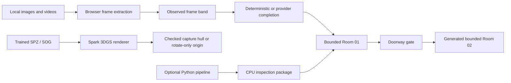

# Spatial Forge

**A local-first image-to-world studio for bounded spatial previews, explicit scene completion, doorway expansion, and trained 3D Gaussian scenes.**

[](https://marinjursic.github.io/SpatialForge/)
[](https://github.com/MarinJursic/SpatialForge/actions/workflows/pages.yml)

Spatial Forge turns one or more local images or videos into an immediately
explorable, full-surround **spatial preview**. Observed imagery remains visually
and textually distinct from completed directions, movement stays inside a bounded
cell, and unmapped doorways must be generated before the viewer can cross them.
The same browser also opens trained `.spz` and `.sog` scenes with anisotropic
Gaussian scales, rotations, opacity, and spherical harmonics through
[Spark](https://github.com/sparkjsdev/spark).

The built-in completion path is deterministic and runs on-device. It builds a
4K equirectangular context from image/video frames, completes unsupported
directions without black regions, and places source-driven wall, floor, and
foreground planes inside that background. Those planes provide clearly visible
limited motion parallax while remaining labeled as **non-metric local fill**.
An optional provider seam can supply model-generated panoramas, but the
interface still labels those pixels as provider-completed rather than observed.

## Continuous application walkthrough

[](docs/walkthrough/app-walkthrough.mp4)

[Open the full-resolution MP4](docs/walkthrough/app-walkthrough.mp4) · [Open the poster frame](docs/walkthrough/app-walkthrough-poster.jpg)

The checked-in walkthrough is a single continuous interaction with the running application:
it opens inside the real 8K room, follows the smooth automated look-around, changes
to the bundled trained kitchen Gaussian, continues the camera sweep at full-splat
detail, and switches theme. It is recorded from the app rather than assembled from
concept images.

## From source image to bounded world

1. Choose **Create world** and select one or more images, videos, or a mixed batch.
2. Spatial Forge decodes each image and samples three or four meaningful positions
   across each video.
3. The observed frames are arranged inside a complete 4096×2048 environment while
   unsupported directions receive deterministic context fill. Up to eight rendered
   captures also texture layered walls, a floor, and foreground depth cards.
4. A perceptual signature collapses repeated rendered captures. The scene record
   reports rendered/unique counts, a conservative source-footprint percentage,
   completion method, unknown-pose registration state, and non-metric geometry.
5. Drag to look, use **Walk** for limited translation, or choose **Approach
   doorway**.
6. At the threshold, the next room is blocked until **Generate beyond doorway**
   completes its four explicit stages.
7. Choose **Enter Room 02** to stream the completed continuation into a new bounded
   navigation cell. The local fallback is a structurally distinct gallery/corridor,
   not a mirrored or color-shifted Room 01. **Return to Room 01** restores its own
   independent evidence record and layered geometry.

This workflow is intentionally not described as single-image 3DGS reconstruction.
Arbitrary photos do not contain the camera calibration, scene overlap, occluded
surfaces, or metric depth needed to train a faithful Gaussian scene. For actual
novel-view geometry, use overlapping capture media in a reconstruction pipeline
and open its trained SPZ/SOG output.

## What opens by default

The included example is the **ESO Guesthouse living room in Vitacura, Chile**, photographed by the European Southern Observatory and published under [CC BY 4.0](https://creativecommons.org/licenses/by/4.0/).

- The repository keeps a 6144×3072 archival derivative and two viewer derivatives. Capable desktop GPUs receive an 8192×4096 texture; constrained devices receive the 4096×2048 fallback after checking the WebGL texture limit.
- Twelve 1280×820 rectilinear source directions drive the filmstrip and source-match view.
- The environment sphere remains present outside Point proxy mode, so rotating or walking never reveals a black void.
- The official source is a true 360°×180° photograph, and the camera can look to within one degree of both zenith and nadir.
- Movement is limited to a declared safe hull because a single-center panorama does not recover metric translation or parallax.
- Point proxy mode exposes a deterministic CPU inspection representation generated from those same real source views.

[Capture context](public/captures/eso-guesthouse/context.jpg) · [8K viewer derivative](public/captures/eso-guesthouse/context-8k.jpg) · [4K compatibility derivative](public/captures/eso-guesthouse/context-webgl.jpg) · [Scene manifest](public/room-demo/manifest.json) · [CPU proxy PLY](public/room-demo/scene.ply) · [Attribution and transformations](THIRD_PARTY_NOTICES.md)

The interface always states which representation is active:

| Label in the app | What it means |
|---|---|
| **360° photographic capture** | An observed equirectangular photograph projected around the viewer; not trained 3DGS |
| **Deterministic completed context** | A full-surround browser preview containing observed frames plus explicitly labeled local fill; non-metric |
| **Local procedural completion** | A structurally new bounded room generated beyond a doorway; 0% observed and independently labeled |
| **Provider-completed context** | A configured completion provider supplied unsupported directions; still non-metric and never relabeled as observed |
| **CPU preview proxy** | Portable isotropic RGB points generated by the reference Python pipeline; not optimized 3DGS |
| **Imported anisotropic Gaussian** | A trained `.spz` or `.sog` loaded locally and rendered by Spark |

This distinction is deliberate. The repository does not present a panorama or point cloud as photorealistic novel-view synthesis.

## Included spatial examples

The example selector provides three materially different, locally bundled records:

| Example | Representation | Purpose |
|---|---|---|
| **ESO photo room** | Adaptive 8192×4096 / 4096×2048 observed 360° context + CPU proxy | Full-surround room review with no uncovered black viewport |
| **Layered capture demo** | Eight rendered directions + deterministic context + six textured depth planes | Immediate, visibly parallaxed non-metric upload-path demonstration |
| **AWS kitchen SOG** | Trained anisotropic Gaussian interior | High-fidelity, movable 3DGS/SOG renderer proof |

The trained sample comes from AWS’s MIT-0 [Open Source 3D Reconstruction Toolbox for Gaussian Splats](https://github.com/aws-solutions-library-samples/guidance-for-open-source-3d-reconstruction-toolbox-for-gaussian-splats-on-aws), where it is published as a representative output of the full media → SfM → Gaussian-training pipeline. [Attribution and local asset details](THIRD_PARTY_NOTICES.md).

## Interaction model

- In the ESO photographic room, drag to look in every direction and use the wheel or
  **Walk** controls to move inside the bounded capture hull.
- The bundled trained kitchen opens at its checked first-person origin with a small,
  manually curated movement hull. Drag looks around, the wheel moves along the view
  direction, and WASD movement is scale-aware and bounded.
- User-imported Gaussian files open at a conservative origin with rotation enabled.
  Translation stays locked because SPZ/SOG files do not standardize a registered
  safe camera hull; the interface states this constraint instead of inventing one.
- **Auto look** performs one continuous 14-second revolution from the current heading,
  with no cut at the start or end.
- **Source match** compares any of the twelve real source directions with the active view.
- **Coverage** shows registered source directions and the navigation boundary.
- **Point proxy** reveals the CPU inspection representation only for photographic and generated captures; trained Gaussian scenes do not expose a duplicate view mode.
- **Scene details** reports source/completion provenance and controls exposure.
- **Create world** accepts one or more images/videos and builds a deterministic full-surround preview on-device. Trained `.spz` or `.sog` files are decoded locally.
- **Approach doorway** moves to an explicit boundary, **Generate beyond doorway** prepares a second bounded room, **Enter Room 02** crosses only after it is ready, and **Return to Room 01** restores the evidence room.
- **Walk** transfers focus to the 3D stage immediately, so WASD works without an
  extra click. The doorway is a true modal gate with focus entry, a Tab loop,
  Escape dismissal when safe, and focus restoration.
- Light and dark themes persist across sessions and preserve full control contrast.

All mode buttons, camera controls, exposure presets, source thumbnails, inspector controls, drag-and-drop handling, and theme switching are functional.

### Rendering fidelity

The renderer follows Spark’s current guidance rather than applying conventional
post-processing to splats:

- WebGL MSAA remains disabled because it does not improve Gaussian footprints and
  adds substantial cost.
- radial sorting is explicit and sorting is allowed every frame, which keeps the
  visible set stable during rapid viewpoint rotation;
- depth-of-field and both Spark blur terms are disabled;
- a modest focal adjustment sharpens projected splats without changing the source data;
- the bundled 358k SOG interior renders its complete splat set. Adaptive
  LoD is reserved for user imports above 1.5 million splats;
- pointer input maps directly to the rendered camera during a drag, while keyboard
  look uses frame-rate-independent damping and reduced-motion preferences disable
  automatic camera movement; and
- the canvas renders at up to 2× device pixel ratio.

These choices improve stability and clarity; they cannot reconstruct geometry that
was never observed by the source cameras.

## Architecture



| Surface | Implementation | Responsibility |
|---|---|---|
| Spatial viewer | Next.js, React, TypeScript, Three.js | Camera, completion context, doorway state, bounded movement, themes |
| Gaussian renderer | `@sparkjsdev/spark` | Native `.spz` / `.sog` decoding and anisotropic 3DGS rendering |
| Reference pipeline | Python, NumPy, Pillow, FFmpeg | Balanced media extraction, quality checks, deterministic proxy packaging |
| Local API | FastAPI | Mixed image/video upload and generated scene delivery |
| Scene contract | JSON, packed binary, PLY | Bounds, camera pose, capture evidence, quality, and provenance |

## Quick start

Prerequisites: Node.js 22.13+, Python 3.11+, and a WebGL2-capable browser.

```bash
npm install
python3 -m venv .venv
.venv/bin/python -m pip install -e '.[test]'

# Terminal 1 — browser viewer
npm run dev

# Terminal 2 — optional CPU inspection worker
DGSI_SCENE_ROOT="$PWD/runtime-scenes" \
  .venv/bin/uvicorn dgsi.api:app --host 127.0.0.1 --port 8016
```

The hosted ESO room, local image/video completion, doorway expansion, trained AWS
kitchen example, and local `.spz` / `.sog` import all work without Python. The
Python service remains an optional inspection-package path.

To use a real image-completion service, set
`NEXT_PUBLIC_WORLD_COMPLETION_API_URL`. The browser expects:

- `POST /complete` with multipart `files`, returning `{ "panorama_url": "…" }`;
- `POST /continue` with `{ "panorama_url": "…", "doorway": "forward" }`,
  returning another `panorama_url`.

If the provider is absent or `/complete` fails, Spatial Forge automatically uses
the deterministic on-device fill. Provider output is disclosed as
**provider-completed context**, not measured scene evidence.

## Capture and import paths

### Open a trained Gaussian scene

Choose **Create world**, select a `.spz` or `.sog`, or drop it directly onto the room. The file is decoded in the browser and is not uploaded. Spark reads the trained representation, derives a camera fit from its bounds, and switches the classification to **Imported anisotropic Gaussian** without retaining unrelated ESO attribution or imagery.

SPZ is the recommended browser format because it preserves Gaussian position, anisotropic scale, rotation, opacity, color, and spherical-harmonic data in a compact package. See the [SPZ reference implementation](https://github.com/nianticlabs/spz).

### Build a spatial preview from images or videos

The picker and drop surface accept several images, several videos, or a mixed
batch. The default browser path:

1. decodes each image and samples three or four temporal positions from each video;
2. places those frames in a 4K equirectangular evidence band;
3. fills zenith, nadir, and missing directions with a deterministic,
   source-derived context;
4. interleaves at most eight frames across assets, hashes the actual rendered
   captures, and collapses repeated visual evidence;
5. reports unknown-pose images as **unregistered**, never as trustworthy angular
   coverage;
6. textures non-metric wall, floor, and foreground planes to provide perceptible
   bounded parallax in front of the no-void context sphere;
7. keeps every completion and doorway-generated room explicitly labeled non-metric.

The optional Python worker still creates deterministic DGSI/PLY inspection
packages for pipeline and API experiments. The production 3D boundary is
intentionally open: use COLMAP camera recovery plus nerfstudio Splatfacto, gsplat,
or another evaluated Gaussian optimizer, export SPZ/SOG, and load that trained
result in the same browser.

## Rebuild the real room example

The source views and CPU proxy can be reproduced from the checked-in licensed context derivative:

```bash
./scripts/make-room-capture.sh
./scripts/build-room-demo.sh
```

`make-room-capture.sh` derives twelve perspective directions with FFmpeg’s `v360` filter. `build-room-demo.sh` packages those views, attaches the real source-grounded environment, constrains the safe hull, and writes the source/license metadata into the manifest.

## Scene package

`scene.dgsi` is a small deterministic reference contract:

```text
bytes 0..3    "DGSI"
uint32        version
uint32        point_count
uint32        stride_floats
repeated f32  x y z | r g b | scale | semantic | motion_phase | change | opacity
```

The browser validates the manifest and binary before allocating geometry. It rejects truncated buffers, non-finite values, semantic IDs outside the contract, invalid navigation bounds, malformed camera paths, and manifest/header disagreement.

This packed reference is intentionally simpler than trained 3DGS. True anisotropic Gaussian data enters through SPZ/SOG and Spark rather than being relabeled into the CPU format.

## Verification

```bash
npm run verify
npm audit
```

The verification pipeline builds the production bundle, type-checks TypeScript, lints the application, exercises the rendered application shell and camera mathematics, verifies the real-photo resolution and attribution contract, validates Spark integration and the bundled trained assets, and runs the Python pipeline and API tests.

The browser-side contracts specifically check:

- continuous, clamped tour progress and one-revolution 360° motion;
- safe-hull translation limits;
- real archived 6144×3072 context, adaptive 8192×4096 and 4096×2048 viewer derivatives, and twelve-source manifest;
- separate photographic, CPU-proxy, and trained-Gaussian classifications;
- Spark initialization, stable radial sorting, zero blur, native `.spz` / `.sog` loading, and an inside-the-bounds camera fit;
- continuous camera damping and a cut-free auto-look revolution;
- conservative observed/completed percentages and an explicit
  idle → threshold → generating → ready doorway state machine;
- persistent light-theme support and accessible controls.

## Accuracy and failure modes

- A single 360° photograph provides complete rotational context, but it does not recover parallax, occluded geometry, collision meshes, or metric translation.
- A perspective image or video frame provides even less spatial evidence. The
  on-device full-surround result and layered room planes provide perceptual
  parallax, not recovered depth, metric geometry, collision, or a trained radiance
  field.
- Doorway continuation generates another bounded context cell. It does not prove
  that a physical room exists beyond the photographed threshold.
- Provider-completed directions can be visually plausible while remaining
  inconsistent across viewpoints. The interface preserves their provenance and
  never mixes them into the observed percentage.
- The CPU output is useful for ingestion, packaging, and inspection tests; it does not optimize anisotropic covariance or appearance.
- A trained SPZ/SOG can provide high-fidelity novel views only within the capture’s trained region. The app does not place unrelated ESO imagery behind imported scenes; uncovered areas use a neutral renderer background and remain visibly outside the trained evidence.
- Unrelated images are kept as an explicit gallery fallback instead of being silently fused.
- Uploads return actionable 4xx responses for unsupported, empty, corrupt, oversized, or over-count batches.
- Web quality still depends on capture overlap, focus, exposure consistency, viewpoint translation, and the optimizer used to create the Gaussian scene.

## Primary references

- Kerbl et al., [3D Gaussian Splatting for Real-Time Radiance Field Rendering](https://repo-sam.inria.fr/fungraph/3d-gaussian-splatting/) (SIGGRAPH 2023)
- Höllein et al., [Text2Room: Extracting Textured 3D Meshes from 2D Text-to-Image Models](https://lukashoel.github.io/text-to-room/) (CVPR 2023)
- Wu et al., [BlockFusion: Expandable 3D Scene Generation using Latent Tri-plane Extrapolation](https://arxiv.org/abs/2401.17053) (2024)
- Deitke et al., [ProcTHOR: Large-Scale Embodied AI Using Procedural Generation](https://procthor.allenai.org/) (NeurIPS 2022)
- Spark, [Three.js 3D Gaussian Splatting renderer](https://github.com/sparkjsdev/spark)
- Spark, [renderer parameters and sorting](https://sparkjs.dev/docs/spark-renderer/) and [performance guidance](https://sparkjs.dev/docs/performance/)
- Niantic Spatial, [SPZ compressed Gaussian format](https://github.com/nianticlabs/spz)
- COLMAP, [Structure-from-Motion tutorial](https://colmap.github.io/tutorial)
- nerfstudio, [Splatfacto documentation](https://docs.nerf.studio/nerfology/methods/splat.html)
- gsplat, [official documentation](https://docs.gsplat.studio/main/)
- ESO, [Guesthouse living room panorama](https://www.eso.org/public/images/gh-livingroom-pan/)

## Repository map

```text
app/                         Spatial Forge, completion logic, doorway state, camera runtime
python/dgsi/                 Ingestion library, CLI, and API
python/tests/                Deterministic pipeline and API tests
public/captures/             Licensed real-photo capture derivatives
public/room-inputs/          Twelve real rectilinear source directions
public/room-demo/            Context, CPU proxy, manifest, and PLY
scripts/                     Reproducible room derivation and packaging
docs/walkthrough/            Continuous MP4, GIF preview, and poster
THIRD_PARTY_NOTICES.md       Media attribution and transformation record
```

The code is released under the repository license. Third-party capture media remains under the license recorded in [THIRD_PARTY_NOTICES.md](THIRD_PARTY_NOTICES.md).
